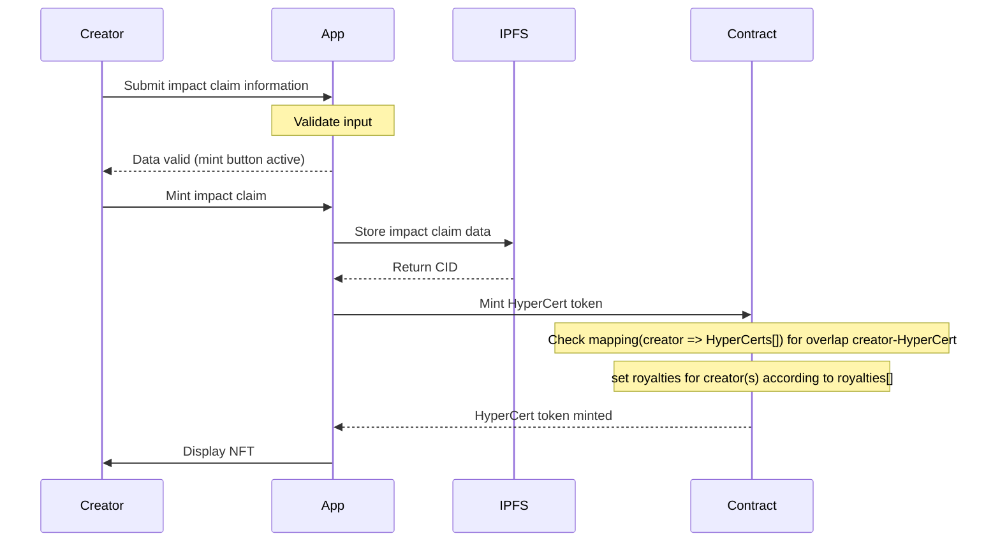

# Minting
- single creator
- user supplies [HyperCert metadata](https://hackmd.io/e3WhpdP8R1eOWgPDspfXVQ?both=#Hypercert-v01) in app

```mermaid
    sequenceDiagram
        participant Creator
        participant App
        participant IPFS
        participant Contract
        Creator->>App: Submit impact claim information
        note over App: Validate input
        App-->>Creator: Data valid (mint button active)
        Creator->>App: Mint impact claim
        App->>IPFS: Store impact claim data
        IPFS-->>App: Return CID
        App->>Contract: Mint HyperCert token
        note over Contract: Check mapping(creator => HyperCerts[]) for overlap creator-HyperCert
        note over Contract: set royalties for creator(s) according to royalties[]
        Contract-->>App: HyperCert token minted
        App->>Creator: Display NFT
```